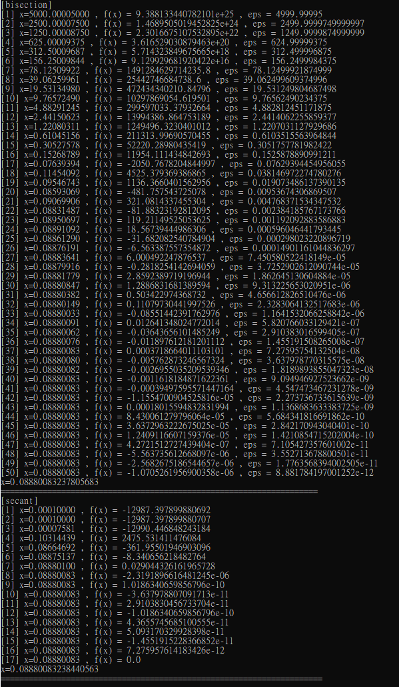

#  example 求單變數 f(x) = 0


$$
\text{solve } 55000 = 6000 \cdot \bigg( \frac{(1+i)^7-1}{i} \bigg)
$$

$$
f(x) = 6000\left[\frac{(1+x)^7-1}{x}\right] - 55000 = 0
$$

```python
def f1(x):
    return 6000*((1+x)**7-1)/x - 55000
```

#### 1.bisection method

```python
def bisection(f,a,b,n=10000):
	print("[bisection]")
	if f(a)*f(b) < 0:
		for i in range(n):
			c = (a+b)/2
			eps = (b-a)/2
			print("[{}] x={:.8f} , f(x) = {} , eps = {}".format(i+1,c,f(c),eps))
			
			# [a,c] 間存在解
			if f(a)*f(c) < 0:
				b = c
			# [c,b] 間存在解
			else:
				a = c
		print("x={}".format(c)) 
	else:
		# 勘跟定理 !! 
		"please find a and b , f(a)f(b) < 0"
	print("====================================================================")
```

#### 2.secant method

```python
def secant(f,x0,x1,n=10000):
	print("[secant]")
	for i in range(n):
		x2 = x1 - f(x1)*(x1-x0)/(f(x1)-f(x0))
		print("[{}] x={:.8f} , f(x) = {} ".format(i+1,x2,f(x2)))
		# 更新點
		x0 = x1
		x1 = x2
		if(f(x2) == 0):
			break
	print("x={}".format(x2)) 
	print("=====================================================================")
```

#### 執行方式:

```shell
python root_finding.py
```

#### 結果:




